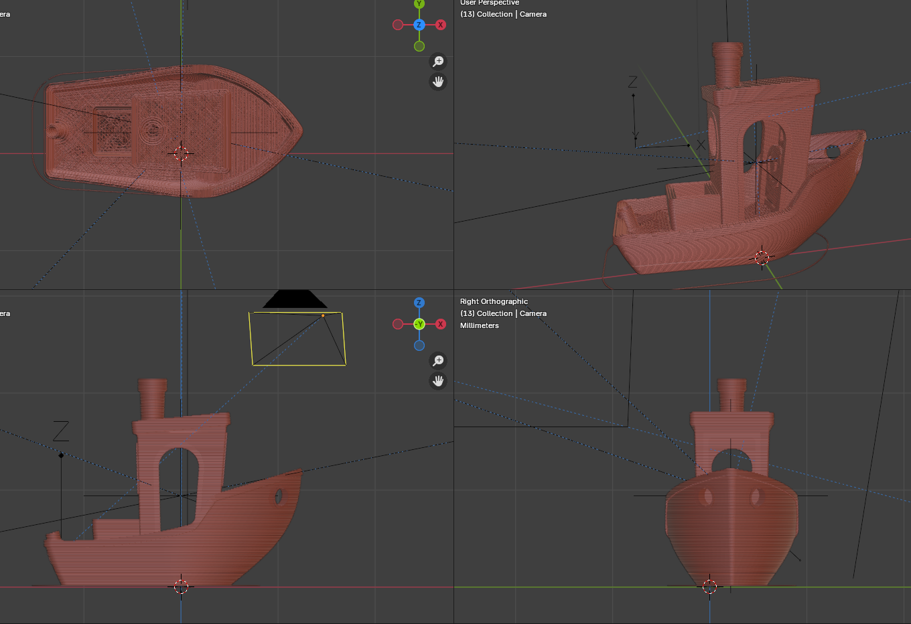
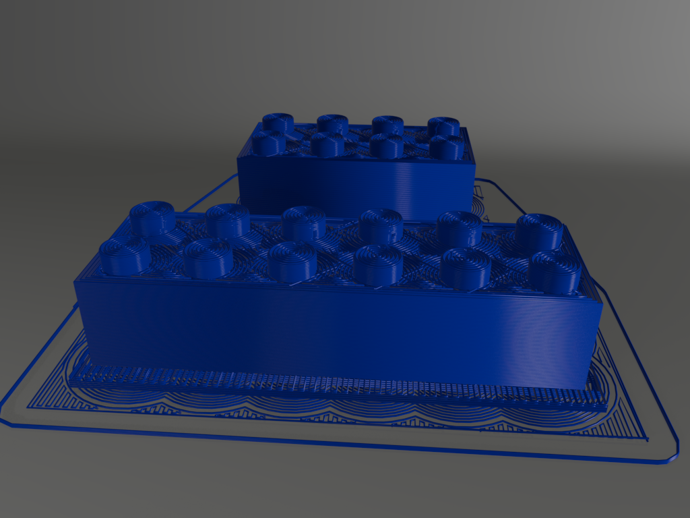
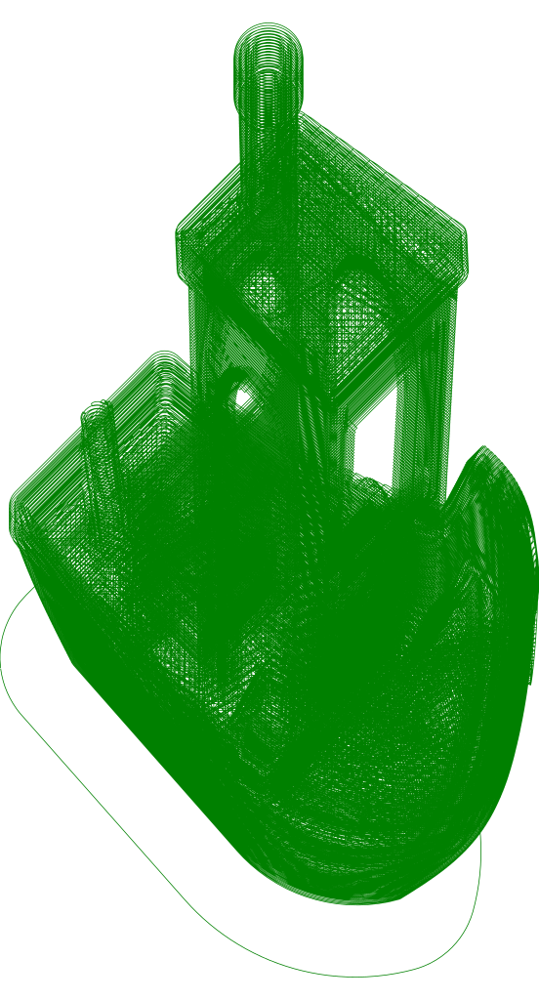

# gcode-nom

Rust 2021 Edition.

A library containing a full set of [nom](https://crates.io/crates/nom) parsers for decoding gcode files.

Based on this library the workspace contains a series of visualisation tools

* gcodeExtractThumbs
* bgcodeViewer - Validator reports on the quality of the file.
* gcode2obj - Generates "WaveFront Obj" files.
* gcode2svg - Generates SVG files.

I intend the parsers to be as stirictly complient as possible. This is under-going rapid development. Please create issues here, or send me gcode files which expose unimplemented sections.

For "binary gcode files" ['.bgcode' extension] the parser are streaming parsers.

See [nom](https://crates.io/crates/nom) - "A byte-oriented, zero-copy, parser combinators library"

## Tools

### bgcodeViewer

 Strict checking of binaries. validates blocks checksums, ensures 'block' parameters values are within valid ranges.

Pass the gcode file into StdIn - A summary file is written to StdOut

 ```rust
 cd bgcodeViewer
 cargo run --release  < ../assets/both\ parts.bgcode > summary.txt
 ```

### gcode2obj

Generates obj files.

Pass the gcode file into StdIn - the obj file is sent to StdOut :-

```bash
cd gcode2obj
cargo run --release -- < ./assets/bency.gcode > bench.obj
```

Which for example can be imported into blender for visualisation.



Within blender :-

1) This obj has been "Imported".
2) Converted into a "Curve".
3) Finally a circular bevel object has been applied to make the object solid [ A circle to represent a 0.1mm fibre].

## gcode2svg

Generate svg files



### How to use

Pass the gcode file into StdIn - the SVG file is sent to StdOut :-

```bash
cd gcode2svg
cargo run --release -- < ./assets/benchy.gcode > benchy.svg
```

## Future work

see [TODO](TODO.md)

A Bevy app?
